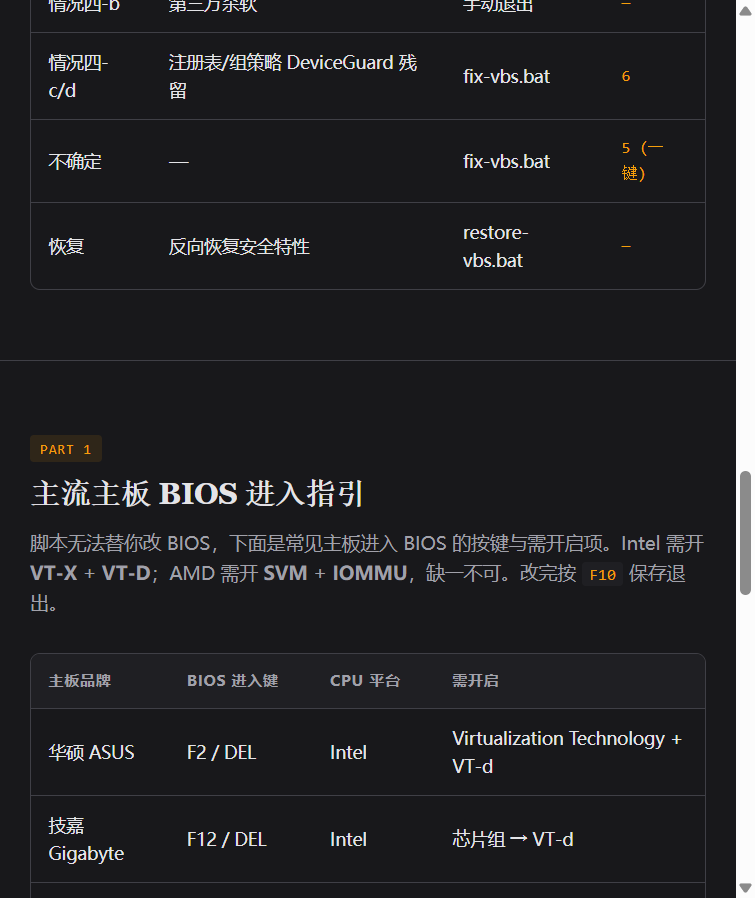

<p align="center">
  
</p>

<h1 align="center">三角洲行动 CPU 虚拟化修复工具包</h1>

<p align="center">
  解决三角洲行动（Delta Force）国服「未开启或有其他软件占用 CPU 虚拟化功能」弹框问题<br>
  对齐腾讯游戏安全团队官方指引 <a href="https://gamesafe.qq.com/article/1181.shtml">gamesafe.qq.com/article/1181.shtml</a>
</p>

<p align="center">
  <a href="https://zuoyou12.github.io/delta-force-vbs-fix/"></a>
</p>

<p align="center">
  
  
  
  
</p>

---

很多玩家 BIOS 里明明已经开启了 VT-X/SVM，但游戏里依然弹「未开启 CPU 虚拟化」的提示。这个工具包就是把官方 4 种弹框情况对应到一组批处理脚本，让普通玩家一键诊断与修复，而不必在 BIOS、注册表、组策略、Windows 功能里逐项翻找。

## 🖥️ 在线诊断页

不想先看文档？打开交互式诊断向导，回答 3 个问题就能拿到你该运行的脚本菜单编号：

👉 **<https://zuoyou12.github.io/delta-force-vbs-fix/>**

<p align="center">
  <a href="https://zuoyou12.github.io/delta-force-vbs-fix/"></a>
</p>

## 快速开始

1. 下载本项目（`Code -> Download ZIP`，解压）。
2. 右键 `diagnose-vbs.bat` -> **以管理员身份运行**，看本机当前命中哪一种情况。
3. 右键 `fix-vbs.bat` -> **以管理员身份运行**，按诊断结论选择对应菜单项；不确定就选 **5 一键自动修复**。
4. 重启电脑，再进游戏验证。若仍弹框，重新运行 `diagnose-vbs.bat` 查看剩余项。
5. 游玩结束后想恢复安全特性，运行 `restore-vbs.bat`。

> 三个 .bat 文件均保存为 UTF-8 with BOM，首行 `chcp 65001 >nul` 切换控制台代码页，中英文 Windows 均不会乱码。

## 官方指引 ↔ 脚本菜单 对照表

| 官方文章章节 | 弹框原因 | 官方操作 | 本项目脚本 |
|---|---|---|---|
| **Part 1** | BIOS 未开 VT-X/VT-D 或 SVM/IOMMU | 手动进 BIOS 开启 | `diagnose-vbs.bat` 检测并提示，详见下方「手动 BIOS 指引」 |
| **情况一** | HVCI 内存完整性占用 | Windows 安全中心 -> 设备安全性 -> 内核隔离 -> 关闭内存完整性 | `fix-vbs.bat` 菜单 **3** |
| **情况二** | VBS 基于虚拟化的安全性 | `bcdedit /set hypervisorlaunchtype off` | `fix-vbs.bat` 菜单 **1** |
| **情况三** | Hyper-V 占用 | 控面板 -> 程序和功能 -> 启用或关闭 Windows 功能 -> 取消 Hyper-V | `fix-vbs.bat` 菜单 **4** |
| **情况四-a** | WindowsHello 面部/指纹阻止 Hyper-V 关闭 | 设置 -> 账户 -> 登录 关面部/指纹 + 删 PIN | `fix-vbs.bat` 菜单 **2**（注册表方式绕过 GUI） |
| **情况四-b** | 第三方杀软占用 | 退出第三方杀软 | `diagnose-vbs.bat` 检测并提示（不自动改） |
| **情况四-c** | 注册表项残留 | regedit 手动改 0 | `fix-vbs.bat` 菜单 **6**（批量归零） |
| **情况四-d** | 组策略 Device Guard | 编辑组策略 -> 计算机配置 -> 管理模板 -> 系统 -> Device Guard -> 已禁用 | `fix-vbs.bat` 菜单 **6**（同上，组策略最终也写注册表） |
| **一键修复** | 不确定 / 全套 | — | `fix-vbs.bat` 菜单 **5** |
| **恢复** | 游戏结束后想恢复安全特性 | 反向操作 | `restore-vbs.bat` |

## 各脚本说明

### `diagnose-vbs.bat`（替代原 `verify-vbs.bat`）

只读检测，不改任何设置，输出 8 项检查：

1. BIOS 层 CPU 虚拟化（`Win32_Processor.VirtualizationFirmwareEnabled`）
2. `bcdedit hypervisorlaunchtype` 当前值
3. VBS 状态（`Win32_DeviceGuard.VirtualizationBasedSecurityStatus`，0/1/2）
4. HVCI 内存完整性（注册表 `HypervisorEnforcedCodeIntegrity.Enabled`）
5. Hyper-V / VMP / HVP / WSL 等 Windows 特性
6. WindowsHello 面部/指纹启用情况（`WinBio` 注册表）
7. 已安装的杀毒软件（`SecurityCenter2.AntiVirusProduct`）
8. DeviceGuard 相关注册表（`EnableVirtualizationBasedSecurity`、`LsaCfgFlags`、`Scenarios\*\Enabled`）

最后给出「命中情况 X -> 运行 fix-vbs.bat 菜单 N」的建议。

### `fix-vbs.bat`（替代原 `fix-hello-vbs.bat`）

菜单驱动，每项操作前后打印状态、写日志到 `fix-vbs.log`：

- 菜单 1：`bcdedit /set hypervisorlaunchtype off` —— 情况二
- 菜单 2：`reg add ...\WindowsHello /v Enabled /d 0` —— 情况四-a
- 菜单 3：`reg add ...\HypervisorEnforcedCodeIntegrity /v Enabled /d 0` —— 情况一
- 菜单 4：`Disable-WindowsOptionalFeature` + `dism /online /disable-feature /featurename:Microsoft-Hyper-V-All` —— 情况三
- 菜单 5：一键自动修复，先检测每项是否已被禁用，跳过已禁用项，依次执行 1+2+3+4+6
- 菜单 6：批量归零 `DeviceGuard` 下 `EnableVirtualizationBasedSecurity`、`LsaCfgFlags`、`HypervisorEnforcedCodeIntegrity`、`SystemGuard`、`CredentialGuard` —— 情况四-c/d
- 菜单 7：重启电脑（5 秒倒计时）

### `restore-vbs.bat`（新增）

反向恢复 `fix-vbs.bat` 所做的修改，重新开启 VBS、WindowsHello、HVCI、Hyper-V、DeviceGuard。

**注意**：仅在你原本就启用了这些特性、且游戏结束后想恢复时运行。如果原本就没启用，请勿运行本脚本以免误开。

## 手动 BIOS 指引（Part 1）

脚本无法替你改 BIOS，需要手动操作。先用 `Win + R -> msinfo32` 查看主板品牌，重启时按下表对应按键进 BIOS。

| 主板品牌 | BIOS 进入键 | CPU 平台 | 需开启的选项 |
|---|---|---|---|
| 华硕 ASUS | F2 或 DEL | Intel | Virtualization Technology + VT-d |
| 技嘉 Gigabyte | F12 或 DEL | Intel | 芯片组 -> VT-d |
| 微星 MSI | DEL | AMD | SVM Mode + IOMMU |
| 惠普 HP | F10（笔电 F2/F10） | Intel/AMD | 先进 -> 系统选项 |
| 戴尔 Dell | F2（部分 F12） | Intel | BIOS Setup -> Virtualization Support |
| 联想 Lenovo | F1 或 Fn+F2 | Intel | 高级菜单 -> Virtualization 技术 + VT-d |
| 联想 Lenovo | F1 或 Fn+F2 | AMD | AMD Secure Virtual Machine + IOMMU |
| 宏碁 Acer | F2 | Intel/AMD | Advanced -> Virtualization |
| 七彩虹 Colorful | DEL | Intel | Advanced -> CPU Virtualization |
| Sony | F2 / ASSIST | — | — |
| Toshiba | F1 / F2（冷开机） | — | — |
| IBM/ThinkPad | F1 | — | — |

修改完按 **F10** 保存并退出。Intel 平台需开 `VT-X` + `VT-D`；AMD 平台需开 `SVM` + `IOMMU`，缺一不可。

> 部分电脑厂商会定制化 BIOS 页面与命令，与教程不符属正常，请联系主板服务提供商获取进一步支持。

## 常见问题 FAQ

**Q: 这是开挂吗？开了会不会封号？**
A: 不是。腾讯游戏安全团队与微软团队合作，要求玩家开启系统硬件安全特性（CPU 虚拟化）以更好地保障对局安全，开启这些功能不会侵犯隐私或影响电脑使用。本工具仅辅助玩家完成官方指引的设置。

**Q: 改完之后能恢复吗？**
A: 可以。运行 `restore-vbs.bat` 即可反向恢复所有修改，重启生效。

**Q: 为什么必须管理员运行？**
A: `bcdedit`、`reg add HKLM`、`DISM`、`Disable-WindowsOptionalFeature` 都需要管理员权限，否则会写不进系统。

**Q: 为什么我关了 Hyper-V 还是弹框？**
A: 检查是否启用了 WindowsHello 面部/指纹识别（情况四-a），它会与 Hyper-V 关联导致关不掉。先在「设置 -> 账户 -> 登录」中暂时关闭面部/指纹、删除 PIN，再关 Hyper-V。

**Q: 关了 Hyper-V 影响我跑 Docker / WSL2 / 安卓模拟器怎么办？**
A: 这些工具都依赖 Hyper-V 或虚拟化平台。游戏期间关掉会影响这些工具，游戏结束后用 `restore-vbs.bat` 恢复即可。如果你重度依赖这些工具，建议改用「情况二 VBS」单独关（`fix-vbs.bat` 菜单 1），保留 Hyper-V。

**Q: 我第三方杀软报毒了？**
A: 本工具仅修改 Windows 系统注册表与特性开关，不含任何可疑行为。部分杀软对修改系统特性敏感，可加白名单或临时退出杀软后再运行。

**Q: 修改后还要做什么？**
A: 重启电脑使修改生效。重启后建议运行 `diagnose-vbs.bat` 复查 VBS 状态是否已变为 0。

## 免责声明

本工具按「原样」提供，作者不对因使用本工具造成的任何系统损坏、数据丢失或游戏账号问题负责。修改注册表、系统特性存在固有风险，**强烈建议在运行前创建系统还原点**（`Win + R -> systempropertiesprotection -> 创建`）。

工具本身仅修改腾讯游戏安全官方指引中明确提到的注册表项与 Windows 特性，不涉及任何游戏文件、反作弊系统或第三方内存修改。

## 致谢与参考

- 腾讯游戏安全团队官方指引：<https://gamesafe.qq.com/article/1181.shtml>
- 腾讯游戏安全恢复指引：<https://gamesafe.qq.com/article/1182.shtml>
- 微软文档 - 禁用 Hyper-V 以运行虚拟化软件：<https://learn.microsoft.com/zh-cn/troubleshoot/windows-client/application-management/virtualization-apps-not-work-with-hyper-v>
- 微软文档 - Device Guard 与 VBS：<https://learn.microsoft.com/zh-cn/windows/security/hardware-security/enable-virtualization-based-protection-of-code-integrity>

## 项目结构

```
.
├── diagnose-vbs.bat     # 诊断脚本（只读）
├── fix-vbs.bat          # 菜单式修复脚本
├── restore-vbs.bat      # 恢复脚本
├── README.md            # 本文件
├── LICENSE              # MIT
├── .gitignore
└── docs/
    ├── index.html       # 交互式 HTML 诊断页（GitHub Pages 托管）
    └── assets/          # README 用图（banner / 截图）
```

## 许可

MIT License — 详见 [LICENSE](./LICENSE)。
